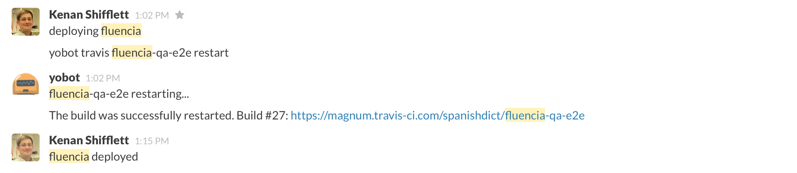

# Yobot
### Our friendly hispanic chatbot
[Daniel Paz-Soldan](http://pazsoldan.com/daniel) / [@danielpazsoldan](https://twitter.com/danielpazsoldan)


## What do we use it for?


### Reminders


### Continuous integration



### Silliness


## Why is it important?


### Yobot makes our job...
* Easier
* Faster
* More enjoyable


### _Visibility_


### Communication
* Asynchronous
* Maintain flow
* Documented
* Remote presence


## How can we use it better?


### Automation
* Kick off travis when **deploying neodarwin**?
* Deploy from Slack?


### Integrate other teams
* Everyone should know when a bug fix or feature has been deployed


## Community scripts 
To use existing scripts, place the name of the script in the hubot-scripts.json file. For example:
```
[
  "redis-brain.coffee"
  "shipit.coffee"
  "<new-script-name>.coffee"
]
```
Check out the [script catalog](http://hubot-script-catalog.herokuapp.com/) and the [hubot-scripts repo](https://github.com/hubot-scripts).


### scrumnotes.coffee
```
hubot take scrum notes - Starts taking notes from all users in the room (records all messages starting with yesterday, today, tomorrow, sun, mon, tue, wed, thu, fri, sat, blocking)
hubot stop taking notes - Stops taking scrum notes (if a path is configured saves day notes to a json file)
hubot scrum notes - shows scrum notes taken so far
hubot are you taking notes? - hubot indicates if he's currently taking notes
```
\#scrumnotes channel?


### pivotal.coffee
```
hubot describe story n - fetch and show information about story n
```


## B.Y.O.Scripts 
* Follow [these guidelines](https://github.com/github/hubot/blob/master/docs/scripting.md)
* Add a script to the [yobot project](https://github.com/spanishdict/yobot)
* Or write an npm package if someone else might find it useful: [example](https://github.com/hubot-scripts/hubot-example)


## Things to consider
* Control signal to noise
* Minimize user input
* Good opportunity for a side project


## Idea time
* Create channels or private groups on demand
```
yobot channel #sometopic @mike @dan
```
* List recent deploys
```
yobot list deploys <repo>
```
* Yobot travis should report green
```
yobot restart travis qa-e2e
```
* More?
